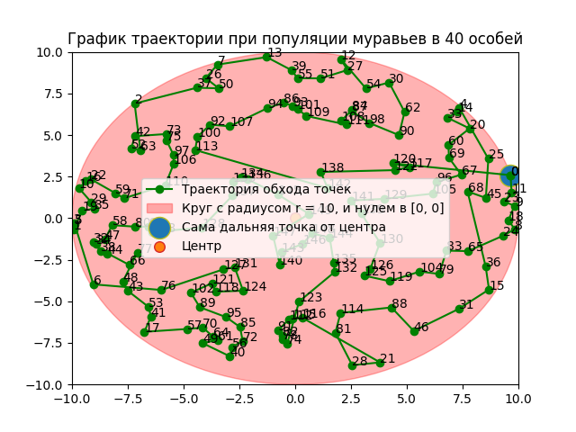
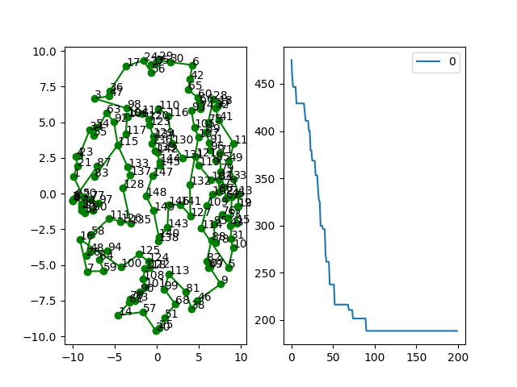

# Optimal_path
Данная программа решает задачу: 
> Необходимо сгенерировать N точек лежащие случайным образом внутри окружности с радиусом R. Необходимо написать алгоритм, который пройдёт по всем точкам внутри окружности, начиная от крайней точки и двигаясь к центру. Необходимо минимизировать перемещения между точками. Результат необходимо отобразить на графике. Для отображения графика можно выбрать любой способ. Алгоритм будет тестироваться с N = 150, R = 10.0

Как интерпретировалась задача: если взять самую крайнюю точку в окружности и построить из нее траекторию в любую другую точку, то это будет считаться направлением к центру. 
С такой формулировкой я могу решать задачу коммивояжёра. Для решения был выбран базовый муравьиный алгоритм
(ant colony optimization) 

Для запуска программы клонируйте репозиторий и выполните команду:

`python main.py 150 10`

По умолчанию в файле main.py 
dist_count = False. 

Если поставить 
dist_count = True, то программа отобразит график длины суммы всех траекторий 

